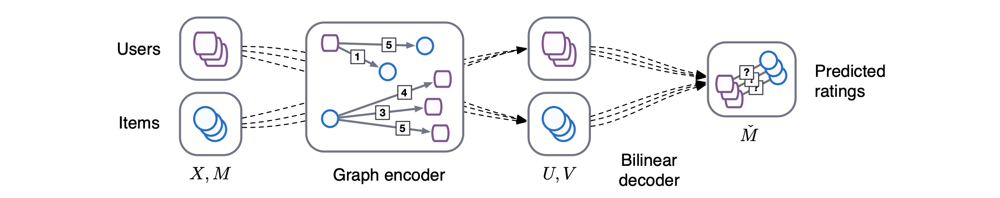

# Graph Attention Matrix Completion (Pytorch)
Includes [PyTorch Implementation] (https://github.com/tanimutomo/gcmc) of [Graph Convolutional Matrix Completion](https://arxiv.org/abs/1706.02263) (PyTorch and PyTorch Geometric)



Improves upon GCMC using graph separation and fusion layers.


## Setup
- Setup a virtual environment with python 3.6 (or newer)
- Requires PyTorch 1.7 (or newer) and CUDA 10.2 (or newer)
- Install requirements (pip)
  ```
  pip install -r requirements.txt
  ```
Installation of Pytorch Geometric is very troublesome and may destroy your python environment.  
So, we strongly recommend to use a virtual environment (e.g. pyenv, virtualenv, pipenv, etc.).  
Please see [Pytorch Geometirc official document](https://rusty1s.github.io/pytorch_geometric/build/html/notes/installation.html) for more details.  


## Train and Test
```
cd src
python train.py
```
- Configuration:  
The settings for train and test are in `config.yml`.  

- Dataset:  
Training dataset is MovieLens-100k.
The dataset is automatically downloaded in `data/` by running `src/train.py`.
